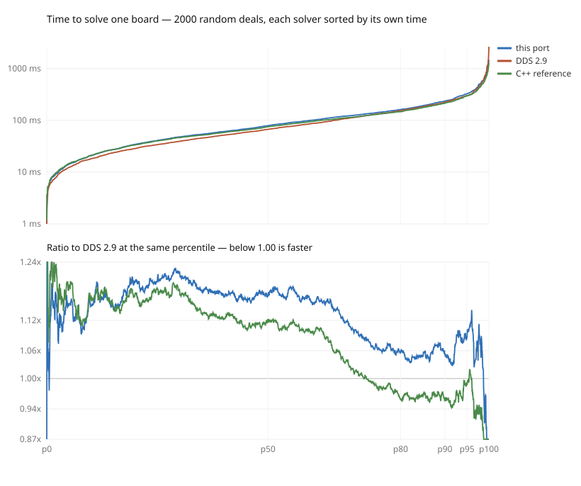

# Three solvers, three ways of using them

Measured 2026-09-02 on an Apple M4 Pro (8 performance cores, 4 efficiency),
macOS 25.5. Method, and why each choice was made, in `METHODOLOGY.md`. Each
solver is built the way its own project builds it: DDS 2.9 with its
`Makefile_Mac_clang_static` (`-O3 -flto`), macroxue's reference at `75b4619`
with the PGO its makefile defaults to, this port with `cargo build --release`.

**DDS 2.9 is 1.00 in every table**, being the one everybody already has.

The short version: **which solver is fastest depends on what you are doing with
it, and the differences that exist are mostly invisible.** There is no single
number here, and anyone quoting one — including us — should say which of these
three questions they answered.

---

## 1. One board, someone waiting

2,000 random deals, full twenty-cell table each, single-threaded, one at a
time. Milliseconds, fastest of an adaptive number of repeats.

| | this port | DDS 2.9 | C++ reference |
|---|---|---|---|
| p50 | 78.7 &nbsp;`1.17x` | **67.1** | 75.3 &nbsp;`1.12x` |
| p80 | 162.0 &nbsp;`1.06x` | 153.5 | **147.0** &nbsp;`0.96x` |
| p90 | 234.9 &nbsp;`1.05x` | 223.7 | **213.1** &nbsp;`0.95x` |
| p95 | 324.7 &nbsp;`1.08x` | 299.5 | **297.2** &nbsp;`0.99x` |
| p99 | 637.6 &nbsp;`0.91x` | 703.2 | **569.6** &nbsp;`0.81x` |
| max | 1480.0 &nbsp;`0.56x` | 2643.1 | **1278.6** &nbsp;`0.48x` |

**There is a crossover, and it is the only finding here that matters.** Grouped
by how hard DDS finds a deal:

| DDS takes | deals | this port | C++ reference | this port wins | reference wins |
|---|---|---|---|---|---|
| under 50 ms | 774 | 1.32x | 1.28x | 26% | 25% |
| 50–100 ms | 525 | 1.23x | 1.15x | 31% | 37% |
| 100–200 ms | 450 | 1.08x | 0.99x | 47% | 56% |
| 200–400 ms | 197 | 1.02x | 0.92x | 53% | 69% |
| 400–800 ms | 40 | 0.92x | 0.82x | 72% | 75% |
| over 800 ms | 14 | **0.73x** | **0.64x** | 86% | 86% |

DDS is quickest on cheap deals and **nobody can perceive the difference** — 67
ms against 79 ms is not a thing a person notices. The two tree searches pull
ahead on expensive deals, which is exactly where a person does notice. Of these
2,000 deals the one DDS finds hardest takes it **2.6 seconds**, where this port
takes 1.5 and the reference 1.3.

So the useful summary for a user is not a ratio, it is: **all three are
instant on easy deals, and on the deals that make you wait, the tree searches
are about a third quicker.**

That also means a mean over a corpus lands wherever the corpus happens to sit
on this curve, which is worth remembering when reading anyone's headline
figure, this repo's included.

---

## 2. One event, 27 boards, someone waiting

The 27 boards of a club session, solved back to back. Deals per second; **above
1.00 is faster than DDS**.

| threads | this port | DDS 2.9 | C++ reference | ours/dds | ref/dds |
|---|---|---|---|---|---|
| 1 | 9.9 | **12.2** | 10.2 | 0.81x | 0.84x |
| 4 | 33.9 | **46.5** | 34.9 | 0.73x | 0.75x |
| 8 | 58.3 | **83.7** | 56.0 | 0.70x | 0.67x |
| 12 | 59.6 | **92.2** | 65.9 | 0.65x | 0.71x |

**DDS wins this one clearly, and the reason is granularity rather than speed.**
Twenty-seven deals is not much to spread over twelve threads when deal cost
spans tenfold: this port hands whole deals to threads from a shared cursor, so
the run ends when the slowest deal ends and several threads have long since
gone idle. DDS's `CalcAllTablesPBN` decomposes into one work item per
(deal, strain) pair — 135 items rather than 27 — and packs them far better.
It shows in the scaling: over these 27 boards DDS reaches 7.6x on twelve
threads where this port reaches 6.0x.

The whole event is under half a second on any of them, so this is a difference
nobody will feel. It is a real and fixable inefficiency on our side all the
same, and finer-grained work items are the fix.

---

## 3. A file of deals, nobody watching

500 random deals. Deals per second; above 1.00 is faster than DDS.

| threads | this port | DDS 2.9 | C++ reference | ours/dds | ref/dds |
|---|---|---|---|---|---|
| 1 | 8.7 | **9.2** | **9.2** | 0.95x | 1.00x |
| 4 | 32.1 | 34.8 | **34.9** | 0.92x | 1.00x |
| 8 | 61.0 | 59.0 | **63.0** | 1.03x | 1.07x |
| 12 | 69.3 | 67.2 | **75.4** | 1.03x | 1.12x |

With enough work to hide the imbalance the picture inverts: past eight threads
both tree searches are ahead, and the reference most of all. Scaling from one
thread to twelve is 8.0x for this port, 7.3x for DDS, 8.2x for the reference —
against eight performance cores plus four efficiency cores contributing perhaps
a third each.

**The reference has no threads at all.** It is single-threaded and not
thread-safe — its caches and statistics are global mutable state — and it has
no multi-deal input either: `main` accepts one deal per invocation, and its own
`parallel_run_tests.sh` fans out with `xargs -P`, one process per deal. Its
column above is that, one process per deal, because that is how it ships. It
does very well at it. But using it on a file of deals means writing the
orchestration yourself, where DDS and this port are a library call.

---

## What to take away

- **Solving one board for someone who is waiting**: all three are
  indistinguishable on ordinary deals. On the hard ones — the top few percent,
  which is where waiting is actually perceptible — the two tree searches finish
  in about two thirds of DDS's time, and DDS's worst case here was 2.6 seconds
  against their 1.3–1.5.
- **Solving one event**: any of them, well under a second. DDS uses a small
  machine's cores better than we do; the gap is our work granularity, not our
  search.
- **Solving a large file**: close, with the tree searches ahead once past eight
  threads. If you want that from the reference you will be writing a shell
  script; the other two give you a thread count.

## What is not controlled

**One machine, and it is not neutral.** The reference has an x86-only fast path
— `PackBits`/`UnpackBits` become `_pext_u64`/`_pdep_u64` under `__BMI2__`, and
its makefile adds `-mbmi2` when `/proc/cpuinfo` reports it — that aarch64
cannot have. Measured, it is worth about 5% to the reference, so its column
would improve by roughly that on a Zen 3 Linux machine. DDS has no
architecture-specific code at all and would not move. This port is in the same
position as the reference.

**One version of each**, at one moment: DDS 2.9, the reference at `75b4619`
(its 2026-01-31 state, which is what this port searches node-for-node), and
this port at the commit that added this file. Upstream's own README claims 1.5x
DDS for a later revision than the one measured here.

**Not an idle machine.** Case 1 uses the fastest of several repeats per deal,
which is what makes that tolerable; cases 2 and 3 are whole-machine
measurements and more exposed, and use the best of five and three rounds
respectively. Ratios rather than absolute figures are what should be read
across from here.

**Random deals**, from a fixed seed, generated by `gen-corpus.py`. Real
collections are not uniformly random, and a collection of hard deals would sit
further right on the case-1 curve than this one does.
